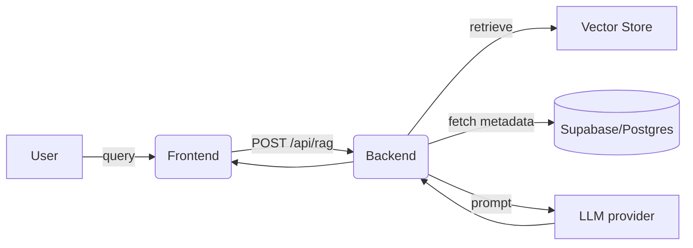

# 03 — System Architecture

This document explains the components, responsibilities and request flow for MINIRAG2.

Components
- Frontend (React): UI, query input, result rendering, feedback collection.
- Backend (FastAPI / Python): API endpoints, RAG orchestration, auth, feedback persistence.
- Vector store / embeddings: stores document vectors for similarity search.
- LLM provider: generates synthesized answers from retrieved context.
- Database (Supabase/Postgres): stores users, documents metadata, feedback and analytics.

High-level data flow

Scaling notes
- Separate vector store (managed service) for large datasets.
- Cache frequent queries and LLM responses.
- Use async calls and batching for embeddings and LLM calls.
